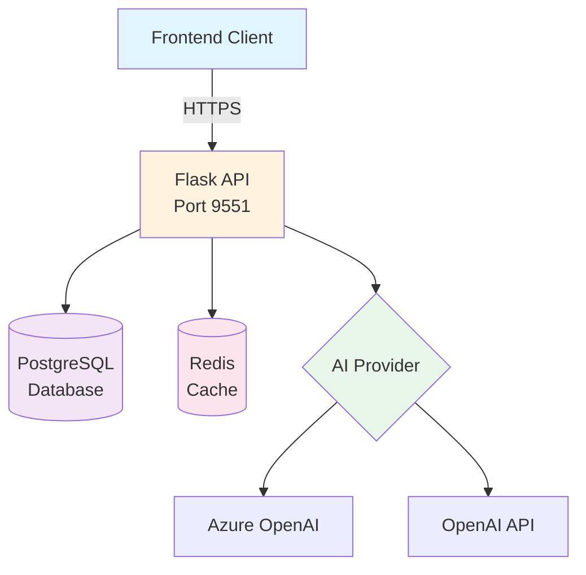
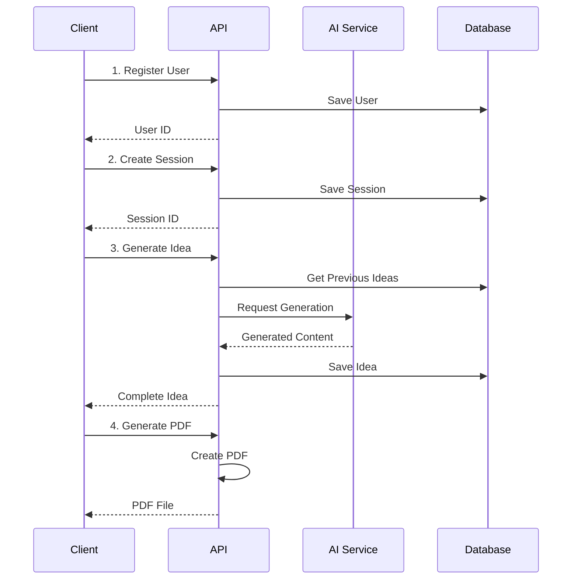

# 🚀 Ideen-Butler API Developer Guide

> **Version:** 1.0.0  
> **Base URL:** `https://ideenbutler.paperworx.ai/api`  
> **Swagger UI:** [https://ideenbutler.paperworx.ai/docs](https://ideenbutler.paperworx.ai/docs)

## 📖 Table of Contents

- [Overview](#overview)
- [Architecture](#architecture)
- [Quick Start](#quick-start)
- [Core Concepts](#core-concepts)
- [API Workflow](#api-workflow)
- [Authentication](#authentication)
- [Error Handling](#error-handling)
- [Code Examples](#code-examples)
  - [Python Examples](#python-examples)
  - [JavaScript Examples](#javascript-examples)
- [Best Practices](#best-practices)
- [Rate Limiting](#rate-limiting)
- [Support](#support)

---

## 🎯 Overview

The **Ideen-Butler API** is a RESTful service that generates AI-powered promotional product ideas using HPM (Haptisches Performance Marketing) methodology. It creates creative, humorous German marketing concepts with clever wordplay and practical product suggestions.

### Key Features
- 🤖 AI-powered idea generation (GPT-5/Azure OpenAI)
- 🎯 German-focused marketing wordplay
- 📊 Session-based idea management
- 📄 PDF generation with watermarks
- 📈 Analytics tracking
- 🔄 Export capabilities

---

## 🏗️ Architecture



### Components

| Component | Description | Technology |
|-----------|-------------|------------|
| **API Server** | RESTful API endpoints | Flask 3.1 + Gunicorn |
| **Database** | Persistent data storage | PostgreSQL 16 |
| **Cache** | Session & rate limiting | Redis 7 |
| **AI Engine** | Idea generation | Azure OpenAI / GPT-5 |
| **PDF Generator** | Document creation | ReportLab |

---

## 🚀 Quick Start

### 1. Test the API

```bash
# Check API health
curl https://ideenbutler.paperworx.ai/api/health

# Response
{
  "status": "healthy",
  "service": "ideen-butler"
}
```

### 2. Create Your First Idea

```bash
# Step 1: Register a user
curl -X POST https://ideenbutler.paperworx.ai/api/users \
  -H "Content-Type: application/json" \
  -d '{
    "email": "max@example.com",
    "first_name": "Max",
    "last_name": "Mustermann",
    "company_name": "Mustermann GmbH",
    "industry": "IT-Dienstleistungen"
  }'

# Step 2: Create a session
curl -X POST https://ideenbutler.paperworx.ai/api/sessions \
  -H "Content-Type: application/json" \
  -d '{
    "user_id": "USER_ID_FROM_STEP_1",
    "occasion": "Messeauftritt"
  }'

# Step 3: Generate an idea
curl -X POST https://ideenbutler.paperworx.ai/api/ideas/generate \
  -H "Content-Type: application/json" \
  -d '{
    "session_id": "SESSION_ID_FROM_STEP_2",
    "additional_info": "Fokus auf Nachhaltigkeit"
  }'
```

---

## 🔑 Core Concepts

### 1. Users
Users represent your customers who need promotional ideas. Each user has:
- Personal information (name, email)
- Company details
- Industry classification

### 2. Sessions
Sessions group related ideas for a specific campaign or occasion:
- Linked to a user
- Defined by an occasion (e.g., "Messeauftritt", "Weihnachtsgeschenk")
- Can contain multiple ideas
- Track session lifecycle

### 3. Ideas
AI-generated promotional concepts consisting of:
- **Product** (`Produkt`) - The physical promotional item
- **Message** (`Botschaft`) - Three clever wordplay slogans
- **Story** (`Geschichte`) - Implementation strategy

### 4. Static Data
Predefined options for dropdowns and forms:
- Industries
- Occasions  
- Company sizes
- Feedback characteristics

---

## 🔄 API Workflow



### Typical User Journey

1. **Registration** → User provides company/personal details
2. **Session Creation** → Define campaign occasion
3. **Idea Generation** → AI creates promotional concept
4. **Review & Rate** → User provides feedback
5. **Export** → Download PDF or export data

---

## 🔐 Authentication

**Current Status:** The API is currently public and doesn't require authentication.

### Future Authentication (Planned)
```javascript
// Future JWT implementation
headers: {
  'Authorization': 'Bearer YOUR_JWT_TOKEN'
}
```

---

## ❌ Error Handling

The API uses standard HTTP status codes:

| Status Code | Meaning |
|------------|---------|
| `200` | Success |
| `201` | Created |
| `400` | Bad Request - Invalid input |
| `404` | Not Found - Resource doesn't exist |
| `500` | Internal Server Error |

### Error Response Format

```json
{
  "error": "Detailed error message",
  "code": "ERROR_CODE",
  "details": {}
}
```

---

## 💻 Code Examples

### Python Examples

#### Complete Implementation

```python
import requests
import json
from typing import Dict, Optional
from datetime import datetime

class IdeenButlerClient:
    """Python client for Ideen-Butler API"""
    
    def __init__(self, base_url: str = "https://ideenbutler.paperworx.ai/api"):
        self.base_url = base_url
        self.session = requests.Session()
        self.session.headers.update({
            'Content-Type': 'application/json'
        })
    
    def register_user(self, email: str, first_name: str, last_name: str, 
                     industry: str, company_name: Optional[str] = None) -> Dict:
        """Register a new user"""
        payload = {
            "email": email,
            "first_name": first_name,
            "last_name": last_name,
            "industry": industry,
            "company_name": company_name
        }
        
        response = self.session.post(
            f"{self.base_url}/users",
            json=payload
        )
        response.raise_for_status()
        return response.json()
    
    def create_session(self, user_id: str, occasion: str) -> Dict:
        """Create a new idea generation session"""
        payload = {
            "user_id": user_id,
            "occasion": occasion
        }
        
        response = self.session.post(
            f"{self.base_url}/sessions",
            json=payload
        )
        response.raise_for_status()
        return response.json()
    
    def generate_idea(self, session_id: str, additional_info: str = "") -> Dict:
        """Generate a new promotional idea"""
        payload = {
            "session_id": session_id,
            "additional_info": additional_info
        }
        
        response = self.session.post(
            f"{self.base_url}/ideas/generate",
            json=payload
        )
        response.raise_for_status()
        return response.json()
    
    def get_pdf(self, idea_id: str, output_path: str = None) -> bytes:
        """Download idea as PDF"""
        response = self.session.get(
            f"{self.base_url}/ideas/{idea_id}/pdf"
        )
        response.raise_for_status()
        
        if output_path:
            with open(output_path, 'wb') as f:
                f.write(response.content)
        
        return response.content
    
    def rate_idea(self, idea_id: str, rating: int, feedback: str = "") -> Dict:
        """Rate an idea (1-5 stars)"""
        payload = {
            "rating": rating,
            "feedback": feedback
        }
        
        response = self.session.post(
            f"{self.base_url}/ideas/{idea_id}/rate",
            json=payload
        )
        response.raise_for_status()
        return response.json()
    
    def get_static_data(self, data_type: str) -> list:
        """Get static data (industries, occasions, etc.)"""
        response = self.session.get(
            f"{self.base_url}/static/{data_type}"
        )
        response.raise_for_status()
        return response.json()
    
    def track_event(self, event_type: str, user_id: str = None, 
                   session_id: str = None, event_data: Dict = None) -> Dict:
        """Track analytics event"""
        payload = {
            "event_type": event_type,
            "user_id": user_id,
            "session_id": session_id,
            "event_data": event_data or {}
        }
        
        response = self.session.post(
            f"{self.base_url}/analytics/track",
            json=payload
        )
        response.raise_for_status()
        return response.json()

# Example Usage
if __name__ == "__main__":
    # Initialize client
    client = IdeenButlerClient()
    
    # Get available industries
    industries = client.get_static_data("industries")
    print(f"Available industries: {industries[:5]}...")
    
    # Register user
    user = client.register_user(
        email=f"test-{datetime.now().timestamp()}@example.com",
        first_name="Max",
        last_name="Mustermann",
        industry="IT-Dienstleistungen",
        company_name="TechStart GmbH"
    )
    print(f"User created: {user['id']}")
    
    # Create session
    session = client.create_session(
        user_id=user['id'],
        occasion="Messeauftritt"
    )
    print(f"Session created: {session['id']}")
    
    # Generate idea
    idea = client.generate_idea(
        session_id=session['id'],
        additional_info="Zielgruppe sind junge Entwickler, Fokus auf Innovation"
    )
    print(f"\nGenerated Idea:")
    print(f"Product: {idea['product'][:100]}...")
    print(f"Message: {idea['message'][:100]}...")
    
    # Rate the idea
    rating = client.rate_idea(
        idea_id=idea['id'],
        rating=5,
        feedback="Sehr kreativ und witzig!"
    )
    
    # Download PDF
    pdf_content = client.get_pdf(
        idea_id=idea['id'],
        output_path=f"idea_{idea['id']}.pdf"
    )
    print(f"PDF saved: idea_{idea['id']}.pdf")
    
    # Track event
    client.track_event(
        event_type="idea_downloaded",
        user_id=user['id'],
        session_id=session['id'],
        event_data={"idea_id": idea['id']}
    )
```

#### Async Implementation with aiohttp

```python
import aiohttp
import asyncio
from typing import Dict, List

class AsyncIdeenButlerClient:
    """Async Python client for parallel API calls"""
    
    def __init__(self, base_url: str = "https://ideenbutler.paperworx.ai/api"):
        self.base_url = base_url
    
    async def generate_multiple_ideas(self, session_id: str, count: int = 3) -> List[Dict]:
        """Generate multiple ideas in parallel"""
        async with aiohttp.ClientSession() as session:
            tasks = []
            for i in range(count):
                task = self._generate_single_idea(
                    session, 
                    session_id, 
                    f"Variante {i+1}"
                )
                tasks.append(task)
            
            ideas = await asyncio.gather(*tasks)
            return ideas
    
    async def _generate_single_idea(self, session: aiohttp.ClientSession, 
                                   session_id: str, additional_info: str) -> Dict:
        """Generate a single idea"""
        url = f"{self.base_url}/ideas/generate"
        payload = {
            "session_id": session_id,
            "additional_info": additional_info
        }
        
        async with session.post(url, json=payload) as response:
            return await response.json()

# Usage
async def main():
    client = AsyncIdeenButlerClient()
    ideas = await client.generate_multiple_ideas("session-123", count=3)
    for i, idea in enumerate(ideas, 1):
        print(f"Idea {i}: {idea['product'][:50]}...")

# Run async function
asyncio.run(main())
```

### JavaScript Examples

#### Modern JavaScript/TypeScript Implementation

```typescript
// ideenButlerClient.ts
interface User {
  id: string;
  email: string;
  first_name: string;
  last_name: string;
  company_name?: string;
  industry: string;
}

interface Session {
  id: string;
  user_id: string;
  occasion: string;
  status: string;
  created_at: string;
}

interface Idea {
  id: string;
  session_id: string;
  product: string;
  message: string;
  story: string;
  ai_provider: string;
  generation_time: number;
}

class IdeenButlerClient {
  private baseUrl: string;
  private headers: HeadersInit;

  constructor(baseUrl: string = 'https://ideenbutler.paperworx.ai/api') {
    this.baseUrl = baseUrl;
    this.headers = {
      'Content-Type': 'application/json',
    };
  }

  /**
   * Register a new user
   */
  async registerUser(userData: {
    email: string;
    first_name: string;
    last_name: string;
    industry: string;
    company_name?: string;
    phone?: string;
  }): Promise<User> {
    const response = await fetch(`${this.baseUrl}/users`, {
      method: 'POST',
      headers: this.headers,
      body: JSON.stringify(userData),
    });

    if (!response.ok) {
      throw new Error(`Registration failed: ${response.statusText}`);
    }

    return response.json();
  }

  /**
   * Create a new session
   */
  async createSession(userId: string, occasion: string): Promise<Session> {
    const response = await fetch(`${this.baseUrl}/sessions`, {
      method: 'POST',
      headers: this.headers,
      body: JSON.stringify({
        user_id: userId,
        occasion: occasion,
      }),
    });

    if (!response.ok) {
      throw new Error(`Session creation failed: ${response.statusText}`);
    }

    return response.json();
  }

  /**
   * Generate a new idea
   */
  async generateIdea(
    sessionId: string,
    additionalInfo: string = ''
  ): Promise<Idea> {
    const response = await fetch(`${this.baseUrl}/ideas/generate`, {
      method: 'POST',
      headers: this.headers,
      body: JSON.stringify({
        session_id: sessionId,
        additional_info: additionalInfo,
      }),
    });

    if (!response.ok) {
      throw new Error(`Idea generation failed: ${response.statusText}`);
    }

    return response.json();
  }

  /**
   * Get all ideas for a session
   */
  async getSessionIdeas(sessionId: string): Promise<Idea[]> {
    const response = await fetch(
      `${this.baseUrl}/sessions/${sessionId}/ideas`
    );

    if (!response.ok) {
      throw new Error(`Failed to fetch ideas: ${response.statusText}`);
    }

    return response.json();
  }

  /**
   * Rate an idea
   */
  async rateIdea(
    ideaId: string,
    rating: number,
    feedback: string = ''
  ): Promise<Idea> {
    const response = await fetch(`${this.baseUrl}/ideas/${ideaId}/rate`, {
      method: 'POST',
      headers: this.headers,
      body: JSON.stringify({
        rating: rating,
        feedback: feedback,
      }),
    });

    if (!response.ok) {
      throw new Error(`Rating failed: ${response.statusText}`);
    }

    return response.json();
  }

  /**
   * Download idea as PDF
   */
  async downloadPDF(ideaId: string): Promise<Blob> {
    const response = await fetch(`${this.baseUrl}/ideas/${ideaId}/pdf`);

    if (!response.ok) {
      throw new Error(`PDF download failed: ${response.statusText}`);
    }

    return response.blob();
  }

  /**
   * Get static data (industries, occasions, etc.)
   */
  async getStaticData(
    type: 'industries' | 'occasions' | 'company-sizes' | 'feedback-characteristics'
  ): Promise<string[]> {
    const response = await fetch(`${this.baseUrl}/static/${type}`);

    if (!response.ok) {
      throw new Error(`Failed to fetch static data: ${response.statusText}`);
    }

    return response.json();
  }

  /**
   * Track analytics event
   */
  async trackEvent(eventData: {
    event_type: string;
    user_id?: string;
    session_id?: string;
    idea_id?: string;
    event_data?: any;
  }): Promise<void> {
    const response = await fetch(`${this.baseUrl}/analytics/track`, {
      method: 'POST',
      headers: this.headers,
      body: JSON.stringify(eventData),
    });

    if (!response.ok) {
      console.error('Failed to track event:', response.statusText);
    }
  }
}

// Example usage
async function main() {
  const client = new IdeenButlerClient();

  try {
    // 1. Get available industries
    const industries = await client.getStaticData('industries');
    console.log('Available industries:', industries.slice(0, 5));

    // 2. Register user
    const user = await client.registerUser({
      email: `test-${Date.now()}@example.com`,
      first_name: 'Max',
      last_name: 'Mustermann',
      industry: 'IT-Dienstleistungen',
      company_name: 'StartUp GmbH',
    });
    console.log('User created:', user.id);

    // 3. Create session
    const session = await client.createSession(user.id, 'Messeauftritt');
    console.log('Session created:', session.id);

    // 4. Generate idea with loading indicator
    console.log('Generating idea...');
    const idea = await client.generateIdea(
      session.id,
      'Focus on sustainability and innovation'
    );
    console.log('Idea generated!');
    console.log('Product:', idea.product.substring(0, 100) + '...');
    console.log('Message:', idea.message.substring(0, 100) + '...');

    // 5. Rate the idea
    await client.rateIdea(idea.id, 5, 'Excellent wordplay!');
    console.log('Idea rated successfully');

    // 6. Download PDF
    const pdfBlob = await client.downloadPDF(idea.id);
    
    // Create download link (browser environment)
    const url = URL.createObjectURL(pdfBlob);
    const a = document.createElement('a');
    a.href = url;
    a.download = `idea-${idea.id}.pdf`;
    a.click();
    URL.revokeObjectURL(url);

    // 7. Track event
    await client.trackEvent({
      event_type: 'idea_downloaded',
      user_id: user.id,
      session_id: session.id,
      idea_id: idea.id,
      event_data: { timestamp: new Date().toISOString() },
    });

  } catch (error) {
    console.error('Error:', error);
  }
}

// Run the example
main();
```

#### React Hook Example

```typescript
// useIdeenButler.ts
import { useState, useCallback } from 'react';

interface IdeaGenerationState {
  loading: boolean;
  error: string | null;
  idea: Idea | null;
}

export function useIdeenButler() {
  const [state, setState] = useState<IdeaGenerationState>({
    loading: false,
    error: null,
    idea: null,
  });

  const client = new IdeenButlerClient();

  const generateIdea = useCallback(async (
    sessionId: string,
    additionalInfo?: string
  ) => {
    setState({ loading: true, error: null, idea: null });

    try {
      const idea = await client.generateIdea(sessionId, additionalInfo);
      setState({ loading: false, error: null, idea });
      
      // Track generation event
      await client.trackEvent({
        event_type: 'idea_generated',
        session_id: sessionId,
        idea_id: idea.id,
      });
      
      return idea;
    } catch (error) {
      setState({
        loading: false,
        error: error instanceof Error ? error.message : 'Unknown error',
        idea: null,
      });
      throw error;
    }
  }, []);

  return {
    ...state,
    generateIdea,
  };
}

// React Component Example
import React, { useState } from 'react';

const IdeaGenerator: React.FC<{ sessionId: string }> = ({ sessionId }) => {
  const { loading, error, idea, generateIdea } = useIdeenButler();
  const [additionalInfo, setAdditionalInfo] = useState('');

  const handleGenerate = async () => {
    try {
      await generateIdea(sessionId, additionalInfo);
    } catch (error) {
      console.error('Generation failed:', error);
    }
  };

  return (
    <div className="idea-generator">
      <div className="input-group">
        <textarea
          value={additionalInfo}
          onChange={(e) => setAdditionalInfo(e.target.value)}
          placeholder="Zusätzliche Informationen..."
          rows={4}
          disabled={loading}
        />
        
        <button 
          onClick={handleGenerate} 
          disabled={loading}
          className="generate-btn"
        >
          {loading ? 'Generiere...' : 'Idee Generieren'}
        </button>
      </div>

      {error && (
        <div className="error-message">
          Fehler: {error}
        </div>
      )}

      {idea && (
        <div className="idea-display">
          <div className="section">
            <h3>Produkt</h3>
            <p>{idea.product}</p>
          </div>
          
          <div className="section">
            <h3>Marketing-Botschaft</h3>
            <p>{idea.message}</p>
          </div>
          
          <div className="section">
            <h3>Geschichte</h3>
            <p>{idea.story}</p>
          </div>
          
          <div className="actions">
            <button onClick={() => downloadPDF(idea.id)}>
              PDF Herunterladen
            </button>
          </div>
        </div>
      )}
    </div>
  );
};
```

#### Node.js Backend Integration

```javascript
// server.js - Express.js proxy example
const express = require('express');
const axios = require('axios');
const NodeCache = require('node-cache');

const app = express();
const cache = new NodeCache({ stdTTL: 600 }); // 10 min cache

app.use(express.json());

// Proxy with caching
app.get('/api/static/:type', async (req, res) => {
  const { type } = req.params;
  const cacheKey = `static_${type}`;
  
  // Check cache
  const cached = cache.get(cacheKey);
  if (cached) {
    return res.json(cached);
  }
  
  try {
    // Fetch from API
    const response = await axios.get(
      `https://ideenbutler.paperworx.ai/api/static/${type}`
    );
    
    // Cache result
    cache.set(cacheKey, response.data);
    
    res.json(response.data);
  } catch (error) {
    res.status(500).json({ error: 'Failed to fetch static data' });
  }
});

// Batch idea generation
app.post('/api/batch-generate', async (req, res) => {
  const { sessionId, count = 3 } = req.body;
  
  const promises = Array.from({ length: count }, (_, i) => 
    axios.post('https://ideenbutler.paperworx.ai/api/ideas/generate', {
      session_id: sessionId,
      additional_info: `Variante ${i + 1}`
    })
  );
  
  try {
    const responses = await Promise.all(promises);
    const ideas = responses.map(r => r.data);
    res.json({ ideas });
  } catch (error) {
    res.status(500).json({ error: 'Batch generation failed' });
  }
});

app.listen(3000, () => {
  console.log('Proxy server running on port 3000');
});
```

---

## 📚 Best Practices

### 1. Session Management
- Create a new session for each campaign/occasion
- Reuse sessions for generating multiple variant ideas
- End sessions when campaign planning is complete

### 2. Error Handling
```javascript
try {
  const idea = await client.generateIdea(sessionId);
} catch (error) {
  if (error.status === 429) {
    // Rate limited - wait and retry
    await sleep(1000);
    return retry();
  } else if (error.status === 500) {
    // Server error - log and notify
    console.error('Server error:', error);
    notifyAdmin(error);
  }
}
```

### 3. Caching Static Data
Static data (industries, occasions) changes rarely. Cache it locally:

```javascript
class CachedClient extends IdeenButlerClient {
  constructor() {
    super();
    this.cache = new Map();
    this.cacheExpiry = 3600000; // 1 hour
  }
  
  async getStaticData(type) {
    const key = `static_${type}`;
    const cached = this.cache.get(key);
    
    if (cached && cached.expiry > Date.now()) {
      return cached.data;
    }
    
    const data = await super.getStaticData(type);
    this.cache.set(key, {
      data,
      expiry: Date.now() + this.cacheExpiry
    });
    
    return data;
  }
}
```

### 4. Retry Logic
```python
import time
from typing import Callable, Any

def retry_with_backoff(func: Callable, max_retries: int = 3) -> Any:
    """Retry function with exponential backoff"""
    for attempt in range(max_retries):
        try:
            return func()
        except Exception as e:
            if attempt == max_retries - 1:
                raise
            wait_time = 2 ** attempt  # Exponential backoff
            time.sleep(wait_time)
    
# Usage
idea = retry_with_backoff(
    lambda: client.generate_idea(session_id, additional_info)
)
```

### 5. Parallel Processing
When generating multiple ideas, use parallel requests:

```python
import concurrent.futures

def generate_multiple_ideas(client, session_id, count=5):
    with concurrent.futures.ThreadPoolExecutor(max_workers=3) as executor:
        futures = [
            executor.submit(
                client.generate_idea, 
                session_id, 
                f"Variante {i+1}"
            )
            for i in range(count)
        ]
        
        ideas = []
        for future in concurrent.futures.as_completed(futures):
            try:
                idea = future.result()
                ideas.append(idea)
            except Exception as e:
                print(f"Failed to generate idea: {e}")
        
        return ideas
```

---

## ⚡ Rate Limiting

- **Default Limits**: 100 requests per minute per IP
- **Idea Generation**: 10 ideas per session
- **Sessions**: 5 sessions per day per user

Handle rate limits gracefully:

```javascript
class RateLimitHandler {
  async executeWithRateLimit(fn, retries = 3) {
    for (let i = 0; i < retries; i++) {
      try {
        return await fn();
      } catch (error) {
        if (error.status === 429) {
          const retryAfter = error.headers['Retry-After'] || 60;
          console.log(`Rate limited. Waiting ${retryAfter}s...`);
          await new Promise(r => setTimeout(r, retryAfter * 1000));
        } else {
          throw error;
        }
      }
    }
  }
}
```

---

## 🧪 Testing

### Unit Test Example (Jest)

```javascript
describe('IdeenButlerClient', () => {
  let client;
  
  beforeEach(() => {
    client = new IdeenButlerClient();
  });
  
  test('should register user successfully', async () => {
    const userData = {
      email: `test-${Date.now()}@example.com`,
      first_name: 'Test',
      last_name: 'User',
      industry: 'IT-Dienstleistungen'
    };
    
    const user = await client.registerUser(userData);
    
    expect(user).toHaveProperty('id');
    expect(user.email).toBe(userData.email);
  });
  
  test('should handle duplicate email', async () => {
    const userData = {
      email: 'duplicate@example.com',
      first_name: 'Test',
      last_name: 'User',
      industry: 'IT-Dienstleistungen'
    };
    
    // First registration
    await client.registerUser(userData);
    
    // Duplicate should fail
    await expect(client.registerUser(userData))
      .rejects
      .toThrow('Registration failed');
  });
});
```

### Integration Test (Python)

```python
import pytest
from ideenbutler_client import IdeenButlerClient

@pytest.fixture
def client():
    return IdeenButlerClient()

@pytest.fixture
def test_user(client):
    """Create a test user"""
    user = client.register_user(
        email=f"test-{datetime.now().timestamp()}@example.com",
        first_name="Test",
        last_name="User",
        industry="IT-Dienstleistungen"
    )
    yield user
    # Cleanup if needed

def test_complete_workflow(client, test_user):
    """Test complete idea generation workflow"""
    
    # Create session
    session = client.create_session(
        user_id=test_user['id'],
        occasion="Testing"
    )
    assert session['id'] is not None
    
    # Generate idea
    idea = client.generate_idea(
        session_id=session['id'],
        additional_info="Test generation"
    )
    assert idea['product'] is not None
    assert idea['message'] is not None
    assert idea['story'] is not None
    
    # Rate idea
    rating = client.rate_idea(
        idea_id=idea['id'],
        rating=5,
        feedback="Test feedback"
    )
    assert rating['rating'] == 5
```

---

## 🔧 Troubleshooting

### Common Issues

| Issue | Solution |
|-------|----------|
| **CORS Errors** | Ensure your domain is whitelisted in API configuration |
| **Timeout on Idea Generation** | AI generation can take 10-30 seconds. Increase client timeout |
| **Empty Responses** | Check if session has reached idea limit (10 per session) |
| **PDF Generation Fails** | Ensure idea exists and has complete data |

### Debug Mode

Enable debug logging:

```python
import logging

logging.basicConfig(level=logging.DEBUG)
logger = logging.getLogger('ideenbutler')

class DebugClient(IdeenButlerClient):
    def __init__(self):
        super().__init__()
        self.debug = True
    
    def _log_request(self, method, url, data=None):
        if self.debug:
            logger.debug(f"{method} {url}")
            if data:
                logger.debug(f"Payload: {json.dumps(data, indent=2)}")
    
    def _log_response(self, response):
        if self.debug:
            logger.debug(f"Status: {response.status_code}")
            logger.debug(f"Response: {response.text[:500]}")
```

---

## 📞 Support

### API Status
Check API health: [https://ideenbutler.paperworx.ai/api/health](https://ideenbutler.paperworx.ai/api/health)

### Documentation
- Swagger UI: [https://ideenbutler.paperworx.ai/docs](https://ideenbutler.paperworx.ai/docs)
- GitHub: [Repository Link]

### Contact
- Technical Issues: [Email]
- Feature Requests: [GitHub Issues]

---

## 📄 License

© 2024 Ideen-Butler. All rights reserved.

---

## 🔄 Changelog

### Version 1.0.0 (Current)
- Initial API release
- GPT-5 integration
- PDF generation with watermarks
- Analytics tracking
- Export capabilities

### Planned Features
- JWT authentication
- WebSocket support for real-time generation
- Batch operations
- Multi-language support

---

*Last Updated: August 2024*