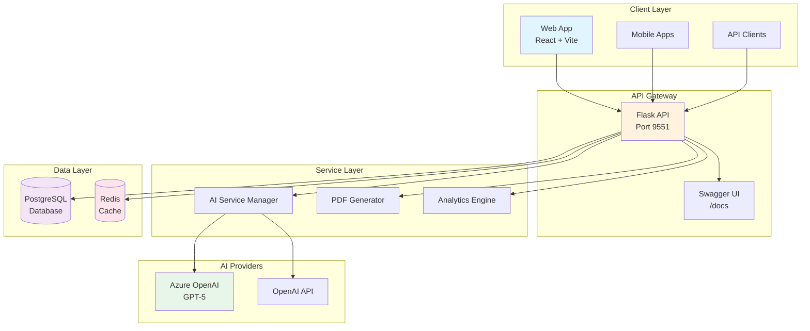
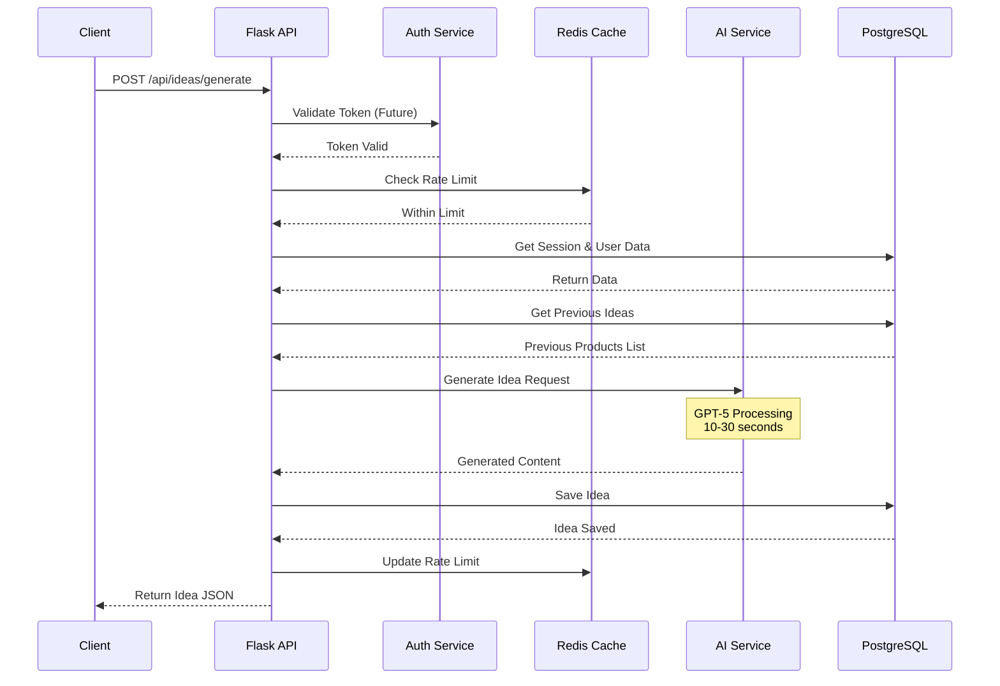

# 🚀 Ideen-Butler API Documentation

> **Version:** 1.0.0  
> **Base URL:** `https://ideenbutler.paperworx.ai/api`  
> **Swagger UI:** [https://ideenbutler.paperworx.ai/docs](https://ideenbutler.paperworx.ai/docs)

## 📖 Table of Contents

- [Overview](#overview)
- [Architecture](#architecture)
- [Authentication](#authentication)
- [API Endpoints](#api-endpoints)
  - [Users](#users)
  - [Sessions](#sessions)
  - [Ideas](#ideas)
  - [Static Data](#static-data)
  - [Analytics](#analytics)
  - [Export](#export)
- [Data Models](#data-models)
- [Error Handling](#error-handling)
- [Rate Limiting](#rate-limiting)
- [Code Examples](#code-examples)
  - [Python](#python-examples)
  - [JavaScript](#javascript-examples)
- [Webhooks](#webhooks)
- [Testing](#testing)

---

## 🎯 Overview

The Ideen-Butler API is a RESTful service that generates AI-powered promotional product ideas using HPM (Haptisches Performance Marketing) methodology. It creates creative, humorous German marketing concepts with clever wordplay and practical product suggestions.

### Key Features
- 🤖 **AI-Powered Generation**: Uses GPT-5 via Azure OpenAI for creative idea generation
- 🎯 **German Marketing Focus**: Specialized in German wordplay and cultural references
- 📊 **Session Management**: Organize ideas by campaign or occasion
- 📄 **PDF Export**: Generate professional PDFs with watermarks
- 📈 **Analytics Tracking**: Monitor usage and performance metrics
- 🔄 **Batch Operations**: Generate multiple ideas efficiently

---

## 🏗️ Architecture

### System Architecture



### Request Flow



---

## 🔐 Authentication

### Current Status
The API is currently **public** and doesn't require authentication.

### Future JWT Implementation (Planned)
```http
Authorization: Bearer YOUR_JWT_TOKEN
```

---

## 📋 API Endpoints

### Users

#### Register User
```http
POST /api/users
Content-Type: application/json

{
  "email": "max@example.com",
  "first_name": "Max",
  "last_name": "Mustermann",
  "company_name": "Mustermann GmbH",
  "industry": "IT-Dienstleistungen",
  "phone": "+49 123 456789",
  "gdpr_consent": true,
  "marketing_consent": false
}
```

**Response:**
```json
{
  "id": "uuid-here",
  "email": "max@example.com",
  "first_name": "Max",
  "last_name": "Mustermann",
  "company_name": "Mustermann GmbH",
  "industry": "IT-Dienstleistungen",
  "created_at": "2024-08-19T10:30:00Z"
}
```

#### Get User
```http
GET /api/users/{user_id}
```

**Note:** The `user_id` parameter type may vary between implementations (integer or UUID string).

#### List Users
```http
GET /api/users
GET /api/users?email=max@example.com
```

---

### Sessions

#### Create Session
```http
POST /api/sessions
Content-Type: application/json

{
  "user_id": "uuid-here",
  "occasion": "Messeauftritt",
  "additional_info": "Tech-Messe in München"
}
```

**Response:**
```json
{
  "id": "session-uuid",
  "user_id": "uuid-here",
  "occasion": "Messeauftritt",
  "status": "active",
  "ideas_generated": 0,
  "created_at": "2024-08-19T10:35:00Z"
}
```

#### Get Session
```http
GET /api/sessions/{session_id}
```

#### End Session
```http
POST /api/sessions/{session_id}/end
```

#### Get Session Ideas
```http
GET /api/sessions/{session_id}/ideas
```

---

### Ideas

#### Generate Idea
```http
POST /api/ideas/generate
Content-Type: application/json

{
  "session_id": "session-uuid",
  "additional_info": "Fokus auf Nachhaltigkeit und Innovation"
}
```

**Alternative Endpoint:**
```http
POST /api/sessions/{session_id}/ideas
Content-Type: application/json

{
  "additional_info": "Fokus auf Nachhaltigkeit"
}
```

**Response:**
```json
{
  "id": "idea-uuid",
  "session_id": "session-uuid",
  "product": "• Intelligenter USB-Stick 'DataBaum'...",
  "message": "1. 'Daten-Baum: Wo Ihre Bits Wurzeln schlagen!'...",
  "story": "• Aufmerksamkeit: Ein USB-Stick in Form eines...",
  "ai_provider": "azure",
  "ai_model": "gpt-5",
  "generation_time": 15.2,
  "quality_score": 0.92,
  "created_at": "2024-08-19T10:40:00Z"
}
```

#### Get Idea
```http
GET /api/ideas/{idea_id}
```

#### Rate Idea
```http
POST /api/ideas/{idea_id}/rate
Content-Type: application/json

{
  "rating": 5,
  "feedback": {
    "feedback_text": "Sehr kreativ und witzig!",
    "characteristics": ["kreativ", "witzig", "praktisch"]
  }
}
```

#### Download PDF
```http
GET /api/ideas/{idea_id}/pdf
```

---

### Static Data

#### Get Industries
```http
GET /api/static/industries
```

**Response:**
```json
[
  "IT-Dienstleistungen",
  "Automobilindustrie",
  "Gesundheitswesen",
  "..."
]
```

#### Get Occasions
```http
GET /api/static/occasions
```

#### Get Company Sizes
```http
GET /api/static/company-sizes
```

#### Get Feedback Characteristics
```http
GET /api/static/feedback-characteristics
```

---

### Analytics

#### Track Event
```http
POST /api/analytics/track
Content-Type: application/json

{
  "event_type": "idea_viewed",
  "user_id": "uuid-here",
  "session_id": "session-uuid",
  "idea_id": "idea-uuid",
  "event_data": {
    "source": "web",
    "browser": "Chrome"
  }
}
```

---

### Export

#### Export Ideas
```http
GET /api/export/ideas?format=json
GET /api/export/ideas?format=csv
```

#### Export Analytics
```http
GET /api/export/analytics?start_date=2024-08-01&end_date=2024-08-31&format=json
```

#### Export Users
```http
GET /api/export/users?format=csv
```

---

## 📊 Data Models

### User Model
```typescript
interface User {
  id: string;
  email?: string;
  first_name: string;
  last_name?: string;
  company_name?: string;
  company_size?: string;
  industry: string;
  phone?: string;
  gdpr_consent: boolean;
  gdpr_consent_date: Date;
  marketing_consent: boolean;
  total_sessions: number;
  total_ideas_generated: number;
  average_rating?: number;
  created_at: Date;
  updated_at: Date;
}
```

### Session Model
```typescript
interface Session {
  id: string;
  user_id: string;
  occasion: string;
  additional_info?: string;
  status: 'active' | 'completed';
  ideas_generated: number;
  average_rating?: number;
  ip_address?: string;
  user_agent?: string;
  created_at: Date;
  ended_at?: Date;
}
```

### Idea Model
```typescript
interface Idea {
  id: string;
  user_id: string;
  session_id: string;
  product: string;
  message: string;
  story: string;
  occasion: string;
  industry: string;
  rating?: number;
  feedback?: string;
  feedback_characteristics?: string[];
  ai_provider: string;
  ai_model: string;
  generation_time: number;
  prompt_tokens?: number;
  completion_tokens?: number;
  total_cost?: number;
  quality_score?: number;
  view_count: number;
  created_at: Date;
  updated_at: Date;
}
```

---

## ❌ Error Handling

### Error Response Format
```json
{
  "error": "Detailed error message",
  "code": "ERROR_CODE",
  "details": {
    "field": "additional context"
  }
}
```

### HTTP Status Codes
| Code | Meaning | Example |
|------|---------|---------|
| `200` | Success | Request completed successfully |
| `201` | Created | New resource created |
| `400` | Bad Request | Invalid input data |
| `401` | Unauthorized | Missing or invalid token (future) |
| `403` | Forbidden | Insufficient permissions |
| `404` | Not Found | Resource doesn't exist |
| `429` | Too Many Requests | Rate limit exceeded |
| `500` | Internal Server Error | Server-side error |
| `503` | Service Unavailable | AI service temporarily down |

---

## ⚡ Rate Limiting

### Current Limits
- **Global**: 100 requests per minute per IP
- **Idea Generation**: 10 ideas per session
- **Sessions**: 5 sessions per day per user
- **PDF Generation**: 20 PDFs per hour per user

### Rate Limit Headers
```http
X-RateLimit-Limit: 100
X-RateLimit-Remaining: 95
X-RateLimit-Reset: 1692442200
Retry-After: 60
```

---

## 💻 Code Examples

### Python Examples

#### Complete Python Client

```python
import requests
import json
from typing import Dict, List, Optional
from datetime import datetime
import time

class IdeenButlerClient:
    """Python client for Ideen-Butler API"""
    
    def __init__(self, base_url: str = "https://ideenbutler.paperworx.ai/api"):
        self.base_url = base_url
        self.session = requests.Session()
        self.session.headers.update({
            'Content-Type': 'application/json',
            'User-Agent': 'IdeenButler-Python-Client/1.0'
        })
    
    def register_user(self, email: str, first_name: str, industry: str, 
                     last_name: str = None, company_name: str = None,
                     phone: str = None, marketing_consent: bool = False) -> Dict:
        """Register a new user"""
        payload = {
            "email": email,
            "first_name": first_name,
            "last_name": last_name,
            "industry": industry,
            "company_name": company_name,
            "phone": phone,
            "gdpr_consent": True,
            "marketing_consent": marketing_consent
        }
        
        response = self.session.post(
            f"{self.base_url}/users",
            json=payload
        )
        response.raise_for_status()
        return response.json()
    
    def create_session(self, user_id: str, occasion: str, 
                      additional_info: str = None) -> Dict:
        """Create a new idea generation session"""
        payload = {
            "user_id": user_id,
            "occasion": occasion,
            "additional_info": additional_info
        }
        
        response = self.session.post(
            f"{self.base_url}/sessions",
            json=payload
        )
        response.raise_for_status()
        return response.json()
    
    def generate_idea(self, session_id: str, additional_info: str = "") -> Dict:
        """Generate a new promotional idea"""
        payload = {
            "session_id": session_id,
            "additional_info": additional_info
        }
        
        # This might take 10-30 seconds
        response = self.session.post(
            f"{self.base_url}/ideas/generate",
            json=payload,
            timeout=60  # Increase timeout for AI generation
        )
        response.raise_for_status()
        return response.json()
    
    def rate_idea(self, idea_id: str, rating: int, 
                  feedback_text: str = "", characteristics: List[str] = None) -> Dict:
        """Rate an idea (1-5 stars)"""
        payload = {
            "rating": rating,
            "feedback": {
                "feedback_text": feedback_text,
                "characteristics": characteristics or []
            }
        }
        
        response = self.session.post(
            f"{self.base_url}/ideas/{idea_id}/rate",
            json=payload
        )
        response.raise_for_status()
        return response.json()
    
    def get_pdf(self, idea_id: str, output_path: str = None) -> bytes:
        """Download idea as PDF"""
        response = self.session.get(
            f"{self.base_url}/ideas/{idea_id}/pdf"
        )
        response.raise_for_status()
        
        if output_path:
            with open(output_path, 'wb') as f:
                f.write(response.content)
        
        return response.content
    
    def get_static_data(self, data_type: str) -> list:
        """Get static data (industries, occasions, etc.)"""
        response = self.session.get(
            f"{self.base_url}/static/{data_type}"
        )
        response.raise_for_status()
        return response.json()
    
    def track_event(self, event_type: str, user_id: str = None,
                   session_id: str = None, idea_id: str = None,
                   event_data: Dict = None) -> Dict:
        """Track analytics event"""
        payload = {
            "event_type": event_type,
            "user_id": user_id,
            "session_id": session_id,
            "idea_id": idea_id,
            "event_data": event_data or {}
        }
        
        response = self.session.post(
            f"{self.base_url}/analytics/track",
            json=payload
        )
        response.raise_for_status()
        return response.json()
    
    def generate_multiple_ideas(self, session_id: str, count: int = 3,
                               variants: List[str] = None) -> List[Dict]:
        """Generate multiple ideas for comparison"""
        ideas = []
        variants = variants or [f"Variante {i+1}" for i in range(count)]
        
        for variant in variants:
            try:
                idea = self.generate_idea(session_id, variant)
                ideas.append(idea)
                # Small delay to avoid overwhelming the API
                time.sleep(1)
            except Exception as e:
                print(f"Failed to generate idea for {variant}: {e}")
                continue
        
        return ideas

# Example Usage
if __name__ == "__main__":
    # Initialize client
    client = IdeenButlerClient()
    
    # Get available industries
    industries = client.get_static_data("industries")
    print(f"Available industries: {industries[:5]}...")
    
    # Register user
    user = client.register_user(
        email=f"test-{datetime.now().timestamp()}@example.com",
        first_name="Max",
        last_name="Mustermann",
        industry="IT-Dienstleistungen",
        company_name="TechStart GmbH",
        marketing_consent=True
    )
    print(f"User created: {user['id']}")
    
    # Create session
    session = client.create_session(
        user_id=user['id'],
        occasion="Messeauftritt",
        additional_info="Internationale Tech-Messe München"
    )
    print(f"Session created: {session['id']}")
    
    # Generate idea
    print("Generating idea (this may take 10-30 seconds)...")
    idea = client.generate_idea(
        session_id=session['id'],
        additional_info="Zielgruppe sind junge Entwickler, Fokus auf Innovation und Humor"
    )
    
    print(f"\n{'='*60}")
    print("Generated Idea:")
    print(f"{'='*60}")
    print(f"\nProdukt:\n{idea['product']}")
    print(f"\nMarketing-Botschaft:\n{idea['message']}")
    print(f"\nGeschichte:\n{idea['story']}")
    print(f"\nGeneration Time: {idea.get('generation_time', 'N/A')}s")
    print(f"AI Provider: {idea.get('ai_provider', 'N/A')}")
    
    # Rate the idea
    rating = client.rate_idea(
        idea_id=idea['id'],
        rating=5,
        feedback_text="Sehr kreativ und witzig! Die Wortspiele sind genial.",
        characteristics=["kreativ", "witzig", "einprägsam", "praktisch"]
    )
    print(f"\nIdea rated: {rating['rating']} stars")
    
    # Generate PDF
    pdf_path = f"idea_{idea['id']}.pdf"
    client.get_pdf(idea['id'], output_path=pdf_path)
    print(f"PDF saved: {pdf_path}")
    
    # Track download event
    client.track_event(
        event_type="pdf_downloaded",
        user_id=user['id'],
        session_id=session['id'],
        idea_id=idea['id'],
        event_data={"format": "pdf", "source": "api_client"}
    )
    
    # Generate multiple ideas for comparison
    print("\nGenerating 3 idea variants...")
    variants = [
        "Fokus auf Humor und Unterhaltung",
        "Fokus auf Praktikabilität",
        "Fokus auf Innovation"
    ]
    
    ideas = client.generate_multiple_ideas(
        session_id=session['id'],
        count=3,
        variants=variants
    )
    
    print(f"\nGenerated {len(ideas)} idea variants")
    for i, idea in enumerate(ideas, 1):
        print(f"Variant {i}: {idea['product'][:100]}...")
```

#### Async Python with aiohttp

```python
import aiohttp
import asyncio
from typing import Dict, List
import json

class AsyncIdeenButlerClient:
    """Async Python client for parallel API calls"""
    
    def __init__(self, base_url: str = "https://ideenbutler.paperworx.ai/api"):
        self.base_url = base_url
        self.headers = {
            'Content-Type': 'application/json',
            'User-Agent': 'IdeenButler-AsyncPython/1.0'
        }
    
    async def generate_idea(self, session: aiohttp.ClientSession,
                          session_id: str, additional_info: str = "") -> Dict:
        """Generate a single idea asynchronously"""
        url = f"{self.base_url}/ideas/generate"
        payload = {
            "session_id": session_id,
            "additional_info": additional_info
        }
        
        async with session.post(url, json=payload, headers=self.headers) as response:
            return await response.json()
    
    async def generate_multiple_ideas(self, session_id: str, 
                                    variants: List[str]) -> List[Dict]:
        """Generate multiple ideas in parallel"""
        async with aiohttp.ClientSession() as session:
            tasks = []
            for variant in variants:
                task = self.generate_idea(session, session_id, variant)
                tasks.append(task)
            
            # Execute all requests in parallel
            ideas = await asyncio.gather(*tasks, return_exceptions=True)
            
            # Filter out any failed requests
            valid_ideas = [idea for idea in ideas if not isinstance(idea, Exception)]
            return valid_ideas
    
    async def batch_rate_ideas(self, idea_ratings: List[tuple]) -> List[Dict]:
        """Rate multiple ideas in parallel"""
        async with aiohttp.ClientSession() as session:
            tasks = []
            for idea_id, rating, feedback in idea_ratings:
                url = f"{self.base_url}/ideas/{idea_id}/rate"
                payload = {
                    "rating": rating,
                    "feedback": {"feedback_text": feedback}
                }
                task = session.post(url, json=payload, headers=self.headers)
                tasks.append(task)
            
            responses = await asyncio.gather(*tasks, return_exceptions=True)
            results = []
            for response in responses:
                if not isinstance(response, Exception):
                    async with response:
                        result = await response.json()
                        results.append(result)
            return results

# Usage example
async def main():
    client = AsyncIdeenButlerClient()
    
    # Generate 5 ideas in parallel
    session_id = "your-session-id"
    variants = [
        "Fokus auf Humor",
        "Fokus auf Innovation",
        "Fokus auf Nachhaltigkeit",
        "Fokus auf Praktikabilität",
        "Fokus auf Originalität"
    ]
    
    print("Generating 5 ideas in parallel...")
    ideas = await client.generate_multiple_ideas(session_id, variants)
    
    print(f"Successfully generated {len(ideas)} ideas")
    for i, idea in enumerate(ideas, 1):
        print(f"Idea {i}: {idea.get('product', 'N/A')[:50]}...")
    
    # Rate all ideas in parallel
    idea_ratings = [
        (idea['id'], 5, "Excellent!") for idea in ideas
    ]
    
    print("\nRating all ideas in parallel...")
    ratings = await client.batch_rate_ideas(idea_ratings)
    print(f"Successfully rated {len(ratings)} ideas")

# Run the async function
if __name__ == "__main__":
    asyncio.run(main())
```

---

### JavaScript Examples

#### Complete TypeScript/JavaScript Client

```typescript
// ideenButlerClient.ts

interface User {
  id: string;
  email?: string;
  first_name: string;
  last_name?: string;
  company_name?: string;
  industry: string;
  created_at: string;
}

interface Session {
  id: string;
  user_id: string;
  occasion: string;
  status: string;
  ideas_generated: number;
  created_at: string;
}

interface Idea {
  id: string;
  session_id: string;
  product: string;
  message: string;
  story: string;
  ai_provider: string;
  ai_model: string;
  generation_time: number;
  quality_score?: number;
  created_at: string;
}

interface IdeaRating {
  rating: number;
  feedback?: {
    feedback_text?: string;
    characteristics?: string[];
  };
}

class IdeenButlerClient {
  private baseUrl: string;
  private headers: HeadersInit;
  private token?: string;

  constructor(baseUrl: string = 'https://ideenbutler.paperworx.ai/api') {
    this.baseUrl = baseUrl;
    this.headers = {
      'Content-Type': 'application/json',
    };
  }

  /**
   * Set authentication token (for future use)
   */
  setToken(token: string): void {
    this.token = token;
    this.headers = {
      ...this.headers,
      'Authorization': `Bearer ${token}`,
    };
  }

  /**
   * Handle API errors
   */
  private async handleResponse<T>(response: Response): Promise<T> {
    if (!response.ok) {
      const error = await response.json().catch(() => ({
        error: response.statusText
      }));
      throw new Error(error.error || `HTTP ${response.status}`);
    }
    return response.json();
  }

  /**
   * Register a new user
   */
  async registerUser(userData: {
    email?: string;
    first_name: string;
    last_name?: string;
    industry: string;
    company_name?: string;
    phone?: string;
    marketing_consent?: boolean;
  }): Promise<User> {
    const response = await fetch(`${this.baseUrl}/users`, {
      method: 'POST',
      headers: this.headers,
      body: JSON.stringify({
        ...userData,
        gdpr_consent: true,
      }),
    });

    return this.handleResponse<User>(response);
  }

  /**
   * Create a new session
   */
  async createSession(
    userId: string,
    occasion: string,
    additionalInfo?: string
  ): Promise<Session> {
    const response = await fetch(`${this.baseUrl}/sessions`, {
      method: 'POST',
      headers: this.headers,
      body: JSON.stringify({
        user_id: userId,
        occasion: occasion,
        additional_info: additionalInfo,
      }),
    });

    return this.handleResponse<Session>(response);
  }

  /**
   * Generate a new idea
   */
  async generateIdea(
    sessionId: string,
    additionalInfo: string = ''
  ): Promise<Idea> {
    const response = await fetch(`${this.baseUrl}/ideas/generate`, {
      method: 'POST',
      headers: this.headers,
      body: JSON.stringify({
        session_id: sessionId,
        additional_info: additionalInfo,
      }),
    });

    return this.handleResponse<Idea>(response);
  }

  /**
   * Generate multiple ideas in sequence with progress callback
   */
  async generateMultipleIdeas(
    sessionId: string,
    count: number = 3,
    onProgress?: (current: number, total: number) => void
  ): Promise<Idea[]> {
    const ideas: Idea[] = [];
    
    for (let i = 0; i < count; i++) {
      if (onProgress) {
        onProgress(i + 1, count);
      }
      
      try {
        const idea = await this.generateIdea(
          sessionId,
          `Variante ${i + 1}`
        );
        ideas.push(idea);
        
        // Small delay between requests
        await new Promise(resolve => setTimeout(resolve, 1000));
      } catch (error) {
        console.error(`Failed to generate idea ${i + 1}:`, error);
      }
    }
    
    return ideas;
  }

  /**
   * Get all ideas for a session
   */
  async getSessionIdeas(sessionId: string): Promise<Idea[]> {
    const response = await fetch(
      `${this.baseUrl}/sessions/${sessionId}/ideas`
    );

    return this.handleResponse<Idea[]>(response);
  }

  /**
   * Rate an idea
   */
  async rateIdea(
    ideaId: string,
    rating: IdeaRating
  ): Promise<Idea> {
    const response = await fetch(`${this.baseUrl}/ideas/${ideaId}/rate`, {
      method: 'POST',
      headers: this.headers,
      body: JSON.stringify(rating),
    });

    return this.handleResponse<Idea>(response);
  }

  /**
   * Download idea as PDF
   */
  async downloadPDF(ideaId: string): Promise<Blob> {
    const response = await fetch(`${this.baseUrl}/ideas/${ideaId}/pdf`);

    if (!response.ok) {
      throw new Error(`PDF download failed: ${response.statusText}`);
    }

    return response.blob();
  }

  /**
   * Download PDF and trigger browser download
   */
  async downloadPDFToFile(ideaId: string, filename?: string): Promise<void> {
    const blob = await this.downloadPDF(ideaId);
    const url = URL.createObjectURL(blob);
    const a = document.createElement('a');
    a.href = url;
    a.download = filename || `idea-${ideaId}.pdf`;
    document.body.appendChild(a);
    a.click();
    document.body.removeChild(a);
    URL.revokeObjectURL(url);
  }

  /**
   * Get static data (industries, occasions, etc.)
   */
  async getStaticData(
    type: 'industries' | 'occasions' | 'company-sizes' | 'feedback-characteristics'
  ): Promise<string[]> {
    const response = await fetch(`${this.baseUrl}/static/${type}`);
    return this.handleResponse<string[]>(response);
  }

  /**
   * Track analytics event
   */
  async trackEvent(eventData: {
    event_type: string;
    user_id?: string;
    session_id?: string;
    idea_id?: string;
    event_data?: any;
  }): Promise<void> {
    const response = await fetch(`${this.baseUrl}/analytics/track`, {
      method: 'POST',
      headers: this.headers,
      body: JSON.stringify(eventData),
    });

    if (!response.ok) {
      console.error('Failed to track event:', response.statusText);
    }
  }

  /**
   * Export data
   */
  async exportData(
    type: 'ideas' | 'users' | 'analytics',
    format: 'json' | 'csv' = 'json',
    params?: Record<string, string>
  ): Promise<any> {
    const queryParams = new URLSearchParams({
      format,
      ...params,
    });

    const response = await fetch(
      `${this.baseUrl}/export/${type}?${queryParams}`
    );

    if (format === 'csv') {
      return response.text();
    }
    return this.handleResponse(response);
  }
}

// Example usage
async function main() {
  const client = new IdeenButlerClient();

  try {
    // 1. Get available industries
    const industries = await client.getStaticData('industries');
    console.log('Available industries:', industries.slice(0, 5));

    // 2. Register user
    const user = await client.registerUser({
      email: `test-${Date.now()}@example.com`,
      first_name: 'Max',
      last_name: 'Mustermann',
      industry: 'IT-Dienstleistungen',
      company_name: 'StartUp GmbH',
      marketing_consent: true,
    });
    console.log('User created:', user.id);

    // 3. Create session
    const session = await client.createSession(
      user.id,
      'Messeauftritt',
      'Tech-Messe München 2024'
    );
    console.log('Session created:', session.id);

    // 4. Generate idea with loading indicator
    console.log('Generating idea (this may take 10-30 seconds)...');
    const startTime = Date.now();
    
    const idea = await client.generateIdea(
      session.id,
      'Focus on sustainability and innovation, target young developers'
    );
    
    const generationTime = (Date.now() - startTime) / 1000;
    console.log(`Idea generated in ${generationTime}s`);
    console.log('Product:', idea.product.substring(0, 200) + '...');
    console.log('Message:', idea.message.substring(0, 200) + '...');

    // 5. Rate the idea
    await client.rateIdea(idea.id, {
      rating: 5,
      feedback: {
        feedback_text: 'Excellent wordplay and creativity!',
        characteristics: ['kreativ', 'witzig', 'einprägsam'],
      },
    });
    console.log('Idea rated successfully');

    // 6. Download PDF
    await client.downloadPDFToFile(idea.id, `werbeidee-${session.occasion}.pdf`);
    console.log('PDF downloaded');

    // 7. Track event
    await client.trackEvent({
      event_type: 'idea_downloaded',
      user_id: user.id,
      session_id: session.id,
      idea_id: idea.id,
      event_data: {
        format: 'pdf',
        timestamp: new Date().toISOString(),
      },
    });

    // 8. Generate multiple ideas with progress
    console.log('\nGenerating 3 idea variants...');
    const ideas = await client.generateMultipleIdeas(
      session.id,
      3,
      (current, total) => {
        console.log(`Progress: ${current}/${total}`);
      }
    );
    console.log(`Generated ${ideas.length} ideas successfully`);

  } catch (error) {
    console.error('Error:', error);
  }
}

// Run the example
if (typeof window !== 'undefined') {
  // Browser environment
  document.addEventListener('DOMContentLoaded', main);
} else {
  // Node.js environment
  main();
}
```

#### React Hook Implementation

```typescript
// hooks/useIdeenButler.ts

import { useState, useCallback, useRef } from 'react';
import { IdeenButlerClient } from '../api/ideenButlerClient';

interface UseIdeenButlerOptions {
  baseUrl?: string;
  onError?: (error: Error) => void;
}

interface IdeaGenerationState {
  loading: boolean;
  error: Error | null;
  idea: Idea | null;
  progress: number;
}

export function useIdeenButler(options: UseIdeenButlerOptions = {}) {
  const [state, setState] = useState<IdeaGenerationState>({
    loading: false,
    error: null,
    idea: null,
    progress: 0,
  });

  const clientRef = useRef(new IdeenButlerClient(options.baseUrl));
  const abortControllerRef = useRef<AbortController | null>(null);

  const generateIdea = useCallback(async (
    sessionId: string,
    additionalInfo?: string
  ) => {
    // Cancel any ongoing request
    if (abortControllerRef.current) {
      abortControllerRef.current.abort();
    }

    abortControllerRef.current = new AbortController();
    
    setState({
      loading: true,
      error: null,
      idea: null,
      progress: 0,
    });

    try {
      // Simulate progress for better UX
      const progressInterval = setInterval(() => {
        setState(prev => ({
          ...prev,
          progress: Math.min(prev.progress + 10, 90),
        }));
      }, 1000);

      const idea = await clientRef.current.generateIdea(
        sessionId,
        additionalInfo
      );

      clearInterval(progressInterval);

      setState({
        loading: false,
        error: null,
        idea,
        progress: 100,
      });

      // Track generation event
      await clientRef.current.trackEvent({
        event_type: 'idea_generated',
        session_id: sessionId,
        idea_id: idea.id,
      });

      return idea;
    } catch (error) {
      const errorObj = error instanceof Error ? error : new Error('Unknown error');
      
      setState({
        loading: false,
        error: errorObj,
        idea: null,
        progress: 0,
      });

      if (options.onError) {
        options.onError(errorObj);
      }

      throw errorObj;
    }
  }, [options]);

  const rateIdea = useCallback(async (
    ideaId: string,
    rating: number,
    feedback?: string,
    characteristics?: string[]
  ) => {
    try {
      const result = await clientRef.current.rateIdea(ideaId, {
        rating,
        feedback: {
          feedback_text: feedback,
          characteristics,
        },
      });

      // Track rating event
      await clientRef.current.trackEvent({
        event_type: 'idea_rated',
        idea_id: ideaId,
        event_data: { rating },
      });

      return result;
    } catch (error) {
      if (options.onError) {
        options.onError(error as Error);
      }
      throw error;
    }
  }, [options]);

  const downloadPDF = useCallback(async (ideaId: string) => {
    try {
      await clientRef.current.downloadPDFToFile(
        ideaId,
        `werbeidee-${new Date().toISOString().split('T')[0]}.pdf`
      );

      // Track download event
      await clientRef.current.trackEvent({
        event_type: 'pdf_downloaded',
        idea_id: ideaId,
      });
    } catch (error) {
      if (options.onError) {
        options.onError(error as Error);
      }
      throw error;
    }
  }, [options]);

  const cancelGeneration = useCallback(() => {
    if (abortControllerRef.current) {
      abortControllerRef.current.abort();
      setState(prev => ({
        ...prev,
        loading: false,
        progress: 0,
      }));
    }
  }, []);

  return {
    ...state,
    generateIdea,
    rateIdea,
    downloadPDF,
    cancelGeneration,
    client: clientRef.current,
  };
}
```

---

## 🔄 Webhooks (Future)

### Webhook Events
```json
{
  "event": "idea.generated",
  "timestamp": "2024-08-19T10:45:00Z",
  "data": {
    "idea_id": "uuid",
    "session_id": "uuid",
    "user_id": "uuid",
    "generation_time": 15.2
  }
}
```

---

## 🧪 Testing

### API Testing with Postman

Import this collection to test the API:

```json
{
  "info": {
    "name": "Ideen-Butler API",
    "schema": "https://schema.getpostman.com/json/collection/v2.1.0/collection.json"
  },
  "variable": [
    {
      "key": "baseUrl",
      "value": "https://ideenbutler.paperworx.ai/api"
    }
  ],
  "item": [
    {
      "name": "Health Check",
      "request": {
        "method": "GET",
        "url": "{{baseUrl}}/health"
      }
    },
    {
      "name": "Register User",
      "request": {
        "method": "POST",
        "url": "{{baseUrl}}/users",
        "body": {
          "mode": "raw",
          "raw": "{\n  \"email\": \"test@example.com\",\n  \"first_name\": \"Test\",\n  \"industry\": \"IT-Dienstleistungen\",\n  \"gdpr_consent\": true\n}"
        }
      }
    }
  ]
}
```

### Unit Testing Example (Jest)

```javascript
describe('IdeenButlerClient', () => {
  let client;
  
  beforeEach(() => {
    client = new IdeenButlerClient();
  });
  
  test('should register user successfully', async () => {
    const userData = {
      email: `test-${Date.now()}@example.com`,
      first_name: 'Test',
      industry: 'IT-Dienstleistungen'
    };
    
    const user = await client.registerUser(userData);
    
    expect(user).toHaveProperty('id');
    expect(user.email).toBe(userData.email);
  });
  
  test('should handle rate limiting gracefully', async () => {
    // Simulate rate limit scenario
    const promises = Array(150).fill(null).map(() => 
      client.getStaticData('industries')
    );
    
    const results = await Promise.allSettled(promises);
    const rejected = results.filter(r => r.status === 'rejected');
    
    expect(rejected.length).toBeGreaterThan(0);
    expect(rejected[0].reason).toContain('429');
  });
});
```

---

## 📞 Support & Resources

### API Status
- Health Check: [https://ideenbutler.paperworx.ai/api/health](https://ideenbutler.paperworx.ai/api/health)
- Swagger UI: [https://ideenbutler.paperworx.ai/docs](https://ideenbutler.paperworx.ai/docs)

### Resources
- [API Developer Guide](./API_DEVELOPER_GUIDE.md)
- [GitHub Repository](#)
- [Support Email](#)

### Common Issues

| Issue | Solution |
|-------|----------|
| CORS Errors | Ensure your domain is whitelisted |
| Timeout on Generation | AI generation takes 10-30s, increase client timeout |
| Rate Limiting | Implement exponential backoff |
| Empty Responses | Check session idea limit (max 10) |

---

## 📄 License

© 2024 Ideen-Butler. All rights reserved.

---

*Last Updated: August 2024*
